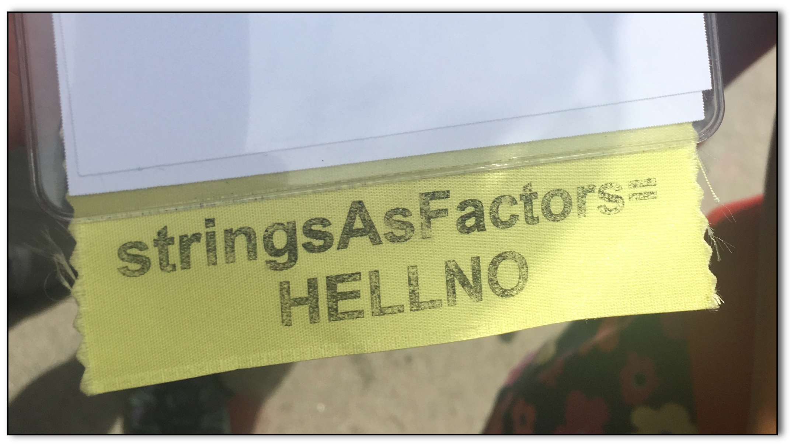

```{r xaringan-themer, include=FALSE, warning=FALSE}
library(xaringanthemer)
style_mono_accent(
  base_color = "#1037A0",
    
  inverse_background_color = "#89c2d9",
  header_font_google = google_font("Josefin Sans"),
  text_font_google   = google_font("Montserrat", "300", "300i"),
  text_font_size = "1.8em",
  code_inline_color = "purple",
  code_font_google   = google_font("Fira Mono")
  )
```

```{r setup, include=FALSE}
options(htmltools.dir.version = FALSE,
        fig.align='center')
library("showtext")
```

```{r xaringan-tachyons, echo=FALSE, eval=TRUE}
xaringanExtra::use_tachyons()
```

```{r, echo=FALSE, eval=TRUE}
library(tibble)
library(datos)
```


</br >

## Datos rectangulares
.fl.w-30[
```{r, echo=FALSE, eval=TRUE, out.width="76%"}
knitr::include_graphics("rectangle1.png")
```
]


Cada fila tiene el mismo número de columnas

Cada columna tiene el mismo número de filas

Las columnas tienen la misma longitud (vectores y factores del mismo largo)

???

En nuestra disciplina dentro de la biología, casi siempre trabajamos con datos rectangulares, sin importar el programa en el que los tengamos.

Rectangulares se refiere que que en una tabla con datos cada fila tiene el mismo número de columnas y cada columna el mismo número de filas. 

En este caso son tres columnas, todas del mismo largo, que conforman cinco filas.

Esto puede ser equivalente a un rango de celdas en una hoja de cálculo, donde necesariamente tenemos un rectangulo de datos, aunque dejemos algunas celdas en blanco.

---

# En R

`data.frame`    

La estructura fundamental para trabajar con datos rectangulares de dos dimensiones.

.pull-left[
```{r, eval=TRUE, echo=FALSE}
data.frame(
  x = c("a", "b", "c"),
  y = c(1, 2, 3)
)
```
]

<style>
.smaller {
  font-size: 70%
}
</style>

</br>
.smaller[
Lista de vectores del mismo largo
]

???
En R, el data frame es la estructura fundamental que usamos para guardar y trabajar con datos rectangulares. En resumen, es una lista de vectores del mismo largo, acomodados en dos dimensiones para formar filas y columnas.

---

<style>
.fakeh1{
  font-family: var(--header-font-family);
  font-size: 2.75rem;
  font-weight: 600;
  color: var(--header-color);
}
</style>

.center[.fakeh1[Tibbles] (/tibls/)]


Modernizando el `data.frame`  

Implementado para todo el `tidyverse` a través de 📦 .b.orange[tibble]

.center[
```{r, eval=TRUE, echo=FALSE}
tibble(
  x = c("a", "b", "c"),
  y = c(1, 2, 3)
)
```
]


???

El objeto tibble hace lo mismo que el data frame. Almacena datos en dos dimensiones usando filas y columnas, pero tiene algunas diferencias fundamentales que lo hacen más apto para los flujos de trabajo modernos.

Para darle un objeto común a los paquetes núcleo del tidyverse, el paquete tibble implementa los objetos tibble, que facilitan una gramática común y unifica los paquetes que más usamos para manejar nuestros datos.

---

Las funciones más utilizadas de .b.orange[dplyr], .b.orange[tidyr], y .b.orange[readr]
</br>

???
Es importante destacar que los tibbles no tienen porque romper nuestros flujos de trabajo. Las funciones de los paquetes que estaremos usando pueden trabajar con data frames, pero generalmente prefieren tibbles y por defecto estos son el tipo de objeto que crean, 
--

reciben un `data.frame` ➡️ regresan un `data.frame`  

--

reciben un `tibble` ➡️ regresan un `tibble`  

--

generan un objeto nuevo ➡️ crean un `tibble`

---

class: center, middle

# ¿Modernizando el `data.frame`?

???

Cuando digo que los tibble son una modernización del data frame, es porque el equipo que creó y mantiene los paquetes del tidyverse modificó algunas de las conductas básicas del data frame para crear un objeto que se presta menos a ambiguedades y que nos obliga, de buena manera, a escribir código más expresivo, es decir, código que hace más con menos, que transmite mejor lo que estamos haciendo, y que se puede interpretar más fácilmente.  

---

```{r, echo=FALSE, eval=TRUE, out.width="85%", fig.align='center'}
knitr::include_graphics("motivational.png")
```

???

para ilustrar los principales cambios, les muestro esta imagen motivacional que es como algo que veríamos en una oficina de gobierno. Esta imagen nos insta a hacer más y quejarnos menos, pero los objetos tibble hacen lo contrario.

---

## tibbles

Hacen menos y se quejan más (por nuestro bien)

***

???
Los tibbles hacen menos, y se quejan más, mediante errores y advertencias.

--

.smaller[
- No asignan nombres a las filas 
]

???
A diferencia de los data frames, los tibbles no tienen un atributo adicional para almacenar rótulos de cada una de las filas. Si queremos esa información, tiene que estar contenida explícitamente en una columna. 

--

.smaller[
- No modifican los nombres de las columnas
]

???

Al crear o modificar data.frames, su comportamiento por defecto es de modificar los nombres de las columnas a un nombre válido en R, esto incluye cambiar espacios o evitar nombres repetidos. cuando esto pasa en un data.frame no hay notificación o advertencia, y esto nos puede tomar por sorpresa.


--

.fl.w-60.pv0[
.smaller[
- No convierten caracteres en factores  

- Exigen nombres completos para seleccionar subconjuntos de variables
]]

```{r, echo=FALSE, eval=TRUE, out.width="40%", fig.align='right'}

```

???

Esto último es más técnico, pero en la mayoría de los casos no queremos que cambie el tipo de dato que hay en cada columna. Cuando tenemos texto en una columna, se queda como texto y no se transforma en una variable categórica con un número fijo de niveles. Además, los tibbles son más estrictos cuando queremos refererirnos a los nombres de las columnas, no permiten confusión o ambiguedad. 

---

class: inverse

<style>
.right-column{
  padding-top: 0;
}
</style>


## Creando `data.frames`

Podemos crear .b[data.frames] de tres maneras:


.pull-left[
Combinando vectores


Convirtiendo `tibbles`


Importando archivos]

.pull-right[.center.top[
.b.purple[`data.frame()`]</br></br> 

.b.purple[`as.data.frame()`]</br></br></br>  

.b.purple[`read.*()`]  
]]

---

class: inverse

<style>
.right-column{
  padding-top: 0;
}
</style>


## Creando `tibbles`

Podemos crear .b[tibbles] de tres maneras:


.pull-left[
Combinando vectores


Convirtiendo `data.frames`


Importando archivos con 📦 .b[`readr`]
]

.pull-right[.center.top[
.b.purple[`tibble()`]</br></br> 

.b.purple[`as_tibble()`]</br></br></br>  

.b.purple[`read_\*()`]  
]]

---

# A crear data.frames 🛠️

.smaller[
Con los vectores `x` & `y`
]

```{r}
  x <- c("a", "b", "c", "d")
  y <- c(1, -2, 3, NA)
```

.smaller[
Creamos un **data.frame** llamado 'prueba_df' y lo imprimimos en la consola
]


```{r}
prueba_df <- data.frame(x,y)
prueba_df
```

---

# A crear tibbles 🛠️

.smaller[
Con los vectores `x` & `y`
]

```{r}
  x <- c("a", "b", "c", "d")
  y <- c(1, -2, 3, NA)
```

.smaller[
Creamos un **tibble** llamado 'prueba_tib' y lo imprimimos en la consola
]


```{r}
prueba_tib <- tibble(x,y)
prueba_tib
```

---

# Más quejas, menos acciones

.smaller[
Con el vector `x`
]
```{r}
x <- c(1, 3, 7, 9)
```

.smaller[
Ejecutemos el siguiente código:
]
```{r, eval=FALSE}
data.frame(x,x)
tibble(x,x)
```

##.center[¿Qué pasó?]

---

</br>

🙋 .smaller[Queremos convertir el `data.frame`  "_mtautos_" del paquete .b[datos] a `tibble` (éste ya se encuentra en nuestro entorno global y la documentación nos dice que es un `data.frame`).</br></br>   ¿Cuál de estás funciones utilizamos?]

a) `tibble(mtautos)`  
b) `as_tibble(mtautos)`  
c) `c(mtautos)`  
d) `read_csv(mtautos)`

---
## Convirtiendo .orange[tibbles] y .orange[data.frames]
.smaller[Carga el paquete `datos`]
```{r, eval=FALSE}
library(datos)
```

.smaller[Convierte el objeto `mtautos` (es un `data.frame`) a `tibble` y guárdalo como '_mtautos_tib_']

.smaller[Convierte el objeto '_mtautos_tib_' a `data.frame`]


---

# Imprimiendo tibbles

.smaller[
Por defecto, la impresión de `tibbles` en la consola nos muestra:
]

--

- Las primeras 10 filas 

--

- Cuántas filas y columnas no se imprimieron

--

- Las columnas que entran en el ancho de nuestra pantalla

--

- El tipo de variable de todas las columnas


---

# Impresión en consola

Imprimamos el objeto bateadores del paquete `datos`

1) Como `data.frame`  
2) Como `tibble`

###.center[¿Cuál nos gusta más?]

---

class: center, middle
## Tibbles
`
- Coexisten con, pero no reemplazan a los **data.frames**

--

- Sin sorpresas al crearlos o modificarlos

--

- Impresión en consola más útil e informativa

---

# Lecturas relevantes

[Tibbles](https://r4ds-en-espaniol.netlify.app/tibbles.html)
, en R for Data Science en Español

Comparando tibbles y data frames, del curso [Stat 545](https://stat545.com/basic-data-care.html#basic-data-care) de la Universidad de British Columbia (en inglés)

La historia de [stringsAsFactors](https://simplystatistics.org/2015/07/24/stringsasfactors-an-unauthorized-biography/) (en inglés)